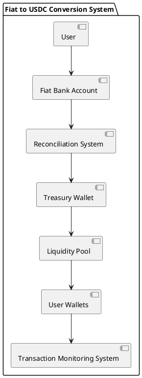
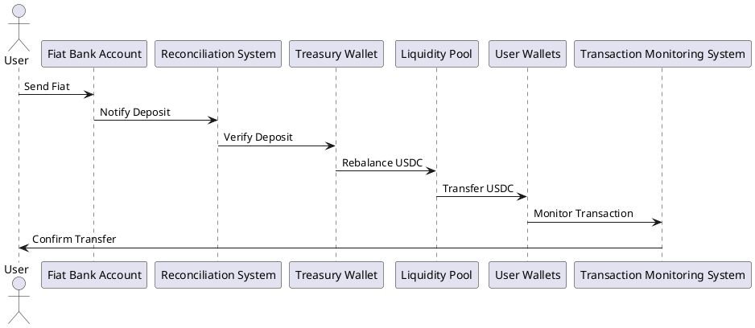

# Project Description

Create a production-ready system for converting fiat currency to USDC through a centralized treasury, focusing on security, reliability, and scalability. The implementation should include all necessary components, from user interaction to blockchain integration.

## System Requirements

### Functional Requirements
1. User Registration and KYC
   - Complete user authentication system
   - KYC/AML compliance integration
   - User wallet management
   - Banking information verification

2. Transaction Processing
   - Real-time fiat deposit detection
   - Automated USDC distribution
   - Transaction status tracking
   - Multi-currency support
   - Exchange rate management

3. Treasury Management
   - Multi-signature wallet implementation
   - Liquidity pool management
   - Rebalancing mechanisms
   - Risk management systems

4. Monitoring and Reporting
   - Real-time transaction monitoring
   - Automated reconciliation
   - Audit trail generation
   - Compliance reporting

### Technical Requirements
1. Architecture
   - Microservices-based design
   - Event-driven architecture
   - High availability setup
   - Disaster recovery planning

2. Security
   - End-to-end encryption
   - Hardware security module (HSM) integration
   - Multi-factor authentication
   - Rate limiting and fraud detection

3. Performance
   - Sub-second transaction processing
   - 99.99% uptime
   - Horizontal scalability
   - Load balancing

## Deliverables Required

### 1. System Architecture
- Detailed component diagrams
- Sequence diagrams for all flows
- Network architecture
- Database schema
- API documentation

### 2. Implementation Details

#### Backend Services
- User Service
  - Complete authentication system
  - KYC integration
  - Wallet management
  - User preferences

- Transaction Service
  - Payment processing
  - Exchange rate management
  - Fee calculation
  - Transaction status tracking

- Treasury Service
  - Wallet management
  - Liquidity pool operations
  - Rebalancing logic
  - Risk management

- Monitoring Service
  - Transaction monitoring
  - Alert management
  - Reporting
  - Analytics

#### Smart Contracts
- Treasury contract
- User wallet contract
- Transaction verification
- Access control

#### Frontend Components
- User dashboard
- Transaction management
- Admin panel
- Reporting interface

### 3. Infrastructure Setup
- Cloud architecture (AWS/GCP/Azure)
- Kubernetes configuration
- CI/CD pipelines
- Monitoring setup

### 4. Documentation
- API documentation
- System architecture documentation
- Deployment guides
- User manuals
- Admin guides
- Security documentation

### 5. Testing Suite
- Unit tests
- Integration tests
- Load tests
- Security tests
- Compliance tests

## Implementation Guidelines

1. Code Quality
- Follow SOLID principles
- Implement design patterns appropriately
- Maintain consistent coding style
- Include comprehensive comments
- Use TypeScript for type safety

2. Security Considerations
- Implement rate limiting
- Use secure communication protocols
- Implement proper authentication
- Follow secure coding practices
- Regular security audits

3. Testing Requirements
- 100% unit test coverage
- Integration tests for critical paths
- Load testing scenarios
- Security testing procedures
- Compliance verification

4. Performance Metrics
- Transaction processing time < 1s
- System uptime > 99.99%
- API response time < 100ms
- Scalability to handle 1000+ TPS

## Additional Requirements

1. Error Handling
- Comprehensive error codes
- Detailed error messages
- Error recovery procedures
- Fallback mechanisms

2. Monitoring
- Real-time dashboards
- Alert configurations
- Performance metrics
- Audit logging

3. Compliance
- GDPR compliance
- Financial regulations
- Data protection
- Audit requirements

4. Deployment
- Blue-green deployment strategy
- Rollback procedures
- Backup strategies
- Disaster recovery plans

## Example Usage

Please provide working examples for:

1. User onboarding flow
2. Transaction processing
3. Treasury management
4. System monitoring
5. Error handling
6. Deployment procedures

## Output Expectations

The response should include:

1. Complete source code for all components
2. Detailed documentation
3. Configuration files
4. Test suites
5. Deployment guides
6. Security protocols
7. Monitoring setup

Note: Generate all diagrams using Mermaid or PlantUML syntax for easy rendering.

## Sample Data

Include sample data for:
1. User profiles
2. Transactions
3. Exchange rates
4. System configurations
5. Test scenarios

## Evaluation Criteria

The implementation will be evaluated based on:
1. Code quality and organization
2. Security measures
3. Performance optimization
4. Documentation completeness
5. Test coverage
6. Deployment readiness
7. Compliance adherence

## Technical Detailed Component Architecture

### Overview

This document provides a detailed overview of the technical component architecture for the production-ready system for converting fiat currency to USDC through a centralized treasury. The architecture focuses on security, reliability, and scalability, and includes all necessary components from user interaction to blockchain integration.

### Key Components and Architecture

#### 1. Treasury Wallet
A secure wallet holding the USDC that will be sent to users after receiving fiat payments. It should be multi-sig or use some form of heightened security (especially for large transfers).

#### 2. Fiat Bank Account (Onramp)
A bank account where users send their fiat. The system will need a reliable way to detect deposits in real-time (via webhook, API integration with the bank, or batch reconciliation).

#### 3. Liquidity Pool (Rebalancing)
The liquidity pool ensures that you have enough USDC to fulfill user requests without draining your treasury wallet. The liquidity pool can be internally managed or connected to external liquidity sources.

#### 4. User Wallets
The destination for the fiat-onramp user’s USDC after rebalancing.

#### 5. Reconciliation System
Tracks all deposits and transactions to ensure that there’s no discrepancy between the fiat received and USDC sent. The system needs a mechanism for comparing bank account records, treasury balances, and user wallet transactions.

#### 6. Transaction Monitoring System
Monitors the state of the blockchain to ensure the USDC transfer is successful. This system should also handle retries for failed transactions.

### Component Diagrams

#### Component Diagram


#### Sequence Diagram


## Transaction Flow Patterns

### Overview

This section provides a detailed overview of the transaction flow patterns for the production-ready system for converting fiat currency to USDC through a centralized treasury. The flow patterns focus on security, reliability, and scalability, and include all necessary components from user interaction to blockchain integration.

### Transaction Flow

#### User Sends Fiat to Bank
- The user initiates a fiat transfer to your bank account.
- You would need to track this transaction in real-time or via batch reconciliation.

#### Fiat Deposit Notification
- The system (via API or webhook) receives notification when fiat is deposited into the bank account.
- The amount deposited is verified against user information (e.g., deposit reference).

#### Fiat to USDC Conversion
- Upon verification, the system ensures sufficient liquidity exists in the treasury or liquidity pool.
- You then rebalance the fiat deposit into USDC from the liquidity pool or treasury.

#### USDC Transfer to User’s Wallet
- The equivalent amount of USDC is sent from the treasury wallet (or liquidity pool) to the user’s wallet on-chain.
- Transaction is logged for transparency and tracking.

#### Confirmation and Reconciliation
- Once the transfer is completed, both the bank and blockchain transactions should be reconciled.
- You verify that the amount of USDC matches the fiat deposited and update the internal ledger.

## Reconciliation Algorithms

### Overview

This section provides a detailed overview of the reconciliation algorithms for the production-ready system for converting fiat currency to USDC through a centralized treasury. The algorithms focus on security, reliability, and scalability, and include all necessary components from user interaction to blockchain integration.

### Reconciliation Process

#### Step 1: Track Deposits
- The system tracks all fiat deposits made to the bank account in real-time or via batch reconciliation.

#### Step 2: Verify Deposits
- The system verifies the amount deposited against user information (e.g., deposit reference).

#### Step 3: Rebalance USDC
- The system ensures sufficient liquidity exists in the treasury or liquidity pool.
- The fiat deposit is rebalanced into USDC from the liquidity pool or treasury.

#### Step 4: Transfer USDC
- The equivalent amount of USDC is sent from the treasury wallet (or liquidity pool) to the user’s wallet on-chain.
- Transaction is logged for transparency and tracking.

#### Step 5: Reconcile Transactions
- The system reconciles both the bank and blockchain transactions to ensure there are no discrepancies.
- The internal ledger is updated to reflect the reconciled transactions.

## Error Handling Strategies

### Overview

This section provides a detailed overview of the error handling strategies for the production-ready system for converting fiat currency to USDC through a centralized treasury. The strategies focus on security, reliability, and scalability, and include all necessary components from user interaction to blockchain integration.

### Error Handling Process

#### Step 1: Detect Errors
- The system detects errors in real-time or via batch processing.

#### Step 2: Log Errors
- The system logs errors for transparency and tracking.

#### Step 3: Notify Users
- The system notifies users of errors via email or SMS.

#### Step 4: Retry Failed Transactions
- The system retries failed transactions to ensure successful completion.

#### Step 5: Escalate Critical Errors
- The system escalates critical errors to the appropriate team for resolution.

## How to Run the Project Locally

To run this project on your local system, follow these steps:

1. **Clone the repository:**
   ```sh
   git clone https://github.com/your-username/fiat-to-usdc-conversion.git
   cd fiat-to-usdc-conversion
   ```

2. **Install dependencies:**
   ```sh
   npm install
   ```

3. **Set up environment variables:**
   Create a `.env` file in the root directory and add the necessary environment variables. Refer to the `.env.example` file for the required variables.

4. **Start the development server:**
   ```sh
   npm run dev
   ```

5. **Access the application:**
   Open your browser and navigate to `http://localhost:3000` to access the application.

## Contribution Guidelines

We welcome contributions to this project! To contribute, follow these steps:

1. **Fork the repository:**
   Click the "Fork" button at the top right corner of this page to create a copy of the repository in your GitHub account.

2. **Clone your forked repository:**
   ```sh
   git clone https://github.com/your-username/fiat-to-usdc-conversion.git
   cd fiat-to-usdc-conversion
   ```

3. **Create a new branch:**
   ```sh
   git checkout -b feature/your-feature-name
   ```

4. **Make your changes:**
   Implement your changes and ensure that the code follows the project's coding standards.

5. **Commit your changes:**
   ```sh
   git add .
   git commit -m "Add your commit message here"
   ```

6. **Push your changes:**
   ```sh
   git push origin feature/your-feature-name
   ```

7. **Create a pull request:**
   Go to the original repository and click the "New Pull Request" button. Provide a detailed description of your changes and submit the pull request.

8. **Review and merge:**
   Your pull request will be reviewed by the project maintainers. Once approved, it will be merged into the main branch.

Thank you for contributing to this project!
