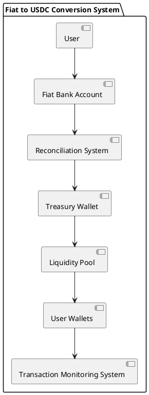
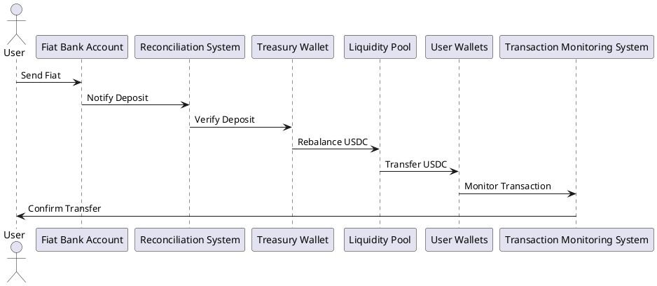
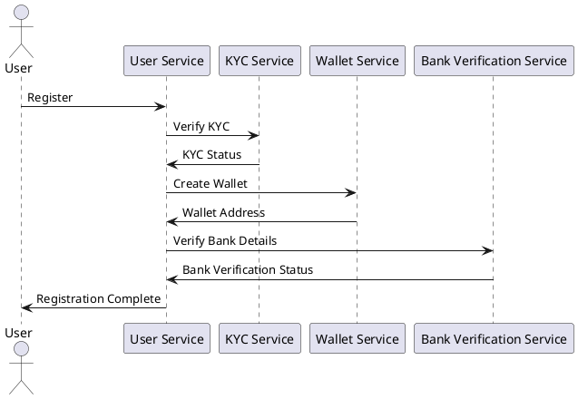
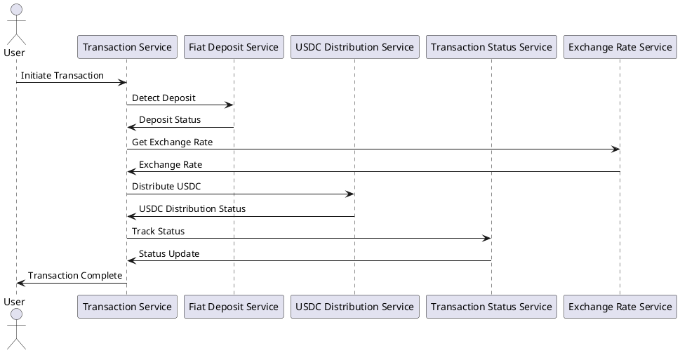

# Project Description

Create a production-ready system for converting fiat currency to USDC through a centralized treasury, focusing on security, reliability, and scalability. The implementation should include all necessary components, from user interaction to blockchain integration.

## System Requirements

### Functional Requirements
1. User Registration and KYC
   - Complete user authentication system
   - KYC/AML compliance integration
   - User wallet management
   - Banking information verification

2. Transaction Processing
   - Real-time fiat deposit detection
   - Automated USDC distribution
   - Transaction status tracking
   - Multi-currency support
   - Exchange rate management

3. Treasury Management
   - Multi-signature wallet implementation
   - Liquidity pool management
   - Rebalancing mechanisms
   - Risk management systems

4. Monitoring and Reporting
   - Real-time transaction monitoring
   - Automated reconciliation
   - Audit trail generation
   - Compliance reporting

### Technical Requirements
1. Architecture
   - Microservices-based design
   - Event-driven architecture
   - High availability setup
   - Disaster recovery planning

2. Security
   - End-to-end encryption
   - Hardware security module (HSM) integration
   - Multi-factor authentication
   - Rate limiting and fraud detection

3. Performance
   - Sub-second transaction processing
   - 99.99% uptime
   - Horizontal scalability
   - Load balancing

## Deliverables Required

### 1. System Architecture
- Detailed component diagrams
- Sequence diagrams for all flows
- Network architecture
- Database schema
- API documentation

### 2. Implementation Details

#### Backend Services
- User Service
  - Complete authentication system
  - KYC integration
  - Wallet management
  - User preferences

- Transaction Service
  - Payment processing
  - Exchange rate management
  - Fee calculation
  - Transaction status tracking

- Treasury Service
  - Wallet management
  - Liquidity pool operations
  - Rebalancing logic
  - Risk management

- Monitoring Service
  - Transaction monitoring
  - Alert management
  - Reporting
  - Analytics

#### Smart Contracts
- Treasury contract
- User wallet contract
- Transaction verification
- Access control

#### Frontend Components
- User dashboard
- Transaction management
- Admin panel
- Reporting interface

### 3. Infrastructure Setup
- Cloud architecture (AWS/GCP/Azure)
- Kubernetes configuration
- CI/CD pipelines
- Monitoring setup

### 4. Documentation
- API documentation
- System architecture documentation
- Deployment guides
- User manuals
- Admin guides
- Security documentation

### 5. Testing Suite
- Unit tests
- Integration tests
- Load tests
- Security tests
- Compliance tests

## Technical Detailed Component Architecture

### Overview

This document provides a detailed overview of the technical component architecture for the production-ready system for converting fiat currency to USDC through a centralized treasury. The architecture focuses on security, reliability, and scalability, and includes all necessary components from user interaction to blockchain integration.

### Key Components and Architecture

#### 1. Treasury Wallet
A secure wallet holding the USDC that will be sent to users after receiving fiat payments. It should be multi-sig or use some form of heightened security (especially for large transfers).

#### 2. Fiat Bank Account (Onramp)
A bank account where users send their fiat. The system will need a reliable way to detect deposits in real-time (via webhook, API integration with the bank, or batch reconciliation).

#### 3. Liquidity Pool (Rebalancing)
The liquidity pool ensures that you have enough USDC to fulfill user requests without draining your treasury wallet. The liquidity pool can be internally managed or connected to external liquidity sources.

#### 4. User Wallets
The destination for the fiat-onramp user’s USDC after rebalancing.

#### 5. Reconciliation System
Tracks all deposits and transactions to ensure that there’s no discrepancy between the fiat received and USDC sent. The system needs a mechanism for comparing bank account records, treasury balances, and user wallet transactions.

#### 6. Transaction Monitoring System
Monitors the state of the blockchain to ensure the USDC transfer is successful. This system should also handle retries for failed transactions.

### Component Diagrams

#### Component Diagram


#### Sequence Diagram


## Transaction Flow Patterns

### Overview

This section provides a detailed overview of the transaction flow patterns for the production-ready system for converting fiat currency to USDC through a centralized treasury. The flow patterns focus on security, reliability, and scalability, and include all necessary components from user interaction to blockchain integration.

### Transaction Flow

#### User Sends Fiat to Bank
- The user initiates a fiat transfer to your bank account.
- You would need to track this transaction in real-time or via batch reconciliation.

#### Fiat Deposit Notification
- The system (via API or webhook) receives notification when fiat is deposited into the bank account.
- The amount deposited is verified against user information (e.g., deposit reference).

#### Fiat to USDC Conversion
- Upon verification, the system ensures sufficient liquidity exists in the treasury or liquidity pool.
- You then rebalance the fiat deposit into USDC from the liquidity pool or treasury.

#### USDC Transfer to User’s Wallet
- The equivalent amount of USDC is sent from the treasury wallet (or liquidity pool) to the user’s wallet on-chain.
- Transaction is logged for transparency and tracking.

#### Confirmation and Reconciliation
- Once the transfer is completed, both the bank and blockchain transactions should be reconciled.
- You verify that the amount of USDC matches the fiat deposited and update the internal ledger.

## Reconciliation Algorithms

### Overview

This section provides a detailed overview of the reconciliation algorithms for the production-ready system for converting fiat currency to USDC through a centralized treasury. The algorithms focus on security, reliability, and scalability, and include all necessary components from user interaction to blockchain integration.

### Reconciliation Process

#### Step 1: Track Deposits
- The system tracks all fiat deposits made to the bank account in real-time or via batch reconciliation.

#### Step 2: Verify Deposits
- The system verifies the amount deposited against user information (e.g., deposit reference).

#### Step 3: Rebalance USDC
- The system ensures sufficient liquidity exists in the treasury or liquidity pool.
- The fiat deposit is rebalanced into USDC from the liquidity pool or treasury.

#### Step 4: Transfer USDC
- The equivalent amount of USDC is sent from the treasury wallet (or liquidity pool) to the user’s wallet on-chain.
- Transaction is logged for transparency and tracking.

#### Step 5: Reconcile Transactions
- The system reconciles both the bank and blockchain transactions to ensure there are no discrepancies.
- The internal ledger is updated to reflect the reconciled transactions.

## Error Handling Strategies

### Overview

This section provides a detailed overview of the error handling strategies for the production-ready system for converting fiat currency to USDC through a centralized treasury. The strategies focus on security, reliability, and scalability, and include all necessary components from user interaction to blockchain integration.

### Error Handling Process

#### Step 1: Detect Errors
- The system detects errors in real-time or via batch processing.

#### Step 2: Log Errors
- The system logs errors for transparency and tracking.

#### Step 3: Notify Users
- The system notifies users of errors via email or SMS.

#### Step 4: Retry Failed Transactions
- The system retries failed transactions to ensure successful completion.

#### Step 5: Escalate Critical Errors
- The system escalates critical errors to the appropriate team for resolution.

## How to Run the Project Locally

To run this project on your local system, follow these steps:

1. **Clone the repository:**
   ```sh
   git clone https://github.com/your-username/fiat-to-usdc-conversion.git
   cd fiat-to-usdc-conversion
   ```

2. **Install dependencies:**
   ```sh
   npm install
   ```

3. **Set up environment variables:**
   Create a `.env` file in the root directory and add the necessary environment variables. Refer to the `.env.example` file for the required variables.

4. **Start the development server:**
   ```sh
   npm run dev
   ```

5. **Access the application:**
   Open your browser and navigate to `http://localhost:3000` to access the application.

## Contribution Guidelines

We welcome contributions to this project! To contribute, follow these steps:

1. **Fork the repository:**
   Click the "Fork" button at the top right corner of this page to create a copy of the repository in your GitHub account.

2. **Clone your forked repository:**
   ```sh
   git clone https://github.com/your-username/fiat-to-usdc-conversion.git
   cd fiat-to-usdc-conversion
   ```

3. **Create a new branch:**
   ```sh
   git checkout -b feature/your-feature-name
   ```

4. **Make your changes:**
   Implement your changes and ensure that the code follows the project's coding standards.

5. **Commit your changes:**
   ```sh
   git add .
   git commit -m "Add your commit message here"
   ```

6. **Push your changes:**
   ```sh
   git push origin feature/your-feature-name
   ```

7. **Create a pull request:**
   Go to the original repository and click the "New Pull Request" button. Provide a detailed description of your changes and submit the pull request.

8. **Review and merge:**
   Your pull request will be reviewed by the project maintainers. Once approved, it will be merged into the main branch.

Thank you for contributing to this project!

## Admin Guides

### Overview

This document provides detailed instructions and guidelines for administrators to manage and maintain the system effectively. It covers various aspects such as user management, transaction monitoring, treasury operations, system configuration, reporting and analytics, security, compliance, backup and disaster recovery, and example usage.

### User Management

#### User Registration
- Ensure that users complete the registration process by providing necessary details such as name, email, and KYC information.
- Verify user identities through the integrated KYC/AML compliance system.
- Manage user wallets and banking information.

#### User Authentication
- Monitor user authentication activities.
- Implement multi-factor authentication for enhanced security.
- Handle user authentication issues and provide support.

### Transaction Monitoring

#### Real-time Monitoring
- Monitor real-time fiat deposit detection and USDC distribution.
- Track transaction statuses and ensure timely processing.
- Manage multi-currency transactions and exchange rates.

#### Alert Management
- Configure and manage alerts for transaction anomalies.
- Respond to alerts and take necessary actions to mitigate risks.
- Maintain an audit trail of all alerts and actions taken.

### Treasury Operations

#### Multi-signature Wallet Management
- Manage multi-signature wallets for secure fund management.
- Ensure proper authorization for all transactions.
- Monitor wallet activities and maintain security protocols.

#### Liquidity Pool Management
- Manage liquidity pools to ensure sufficient funds for transactions.
- Implement rebalancing mechanisms to maintain optimal liquidity levels.
- Monitor and manage risks associated with liquidity pools.

### System Configuration

#### Cloud Architecture
- Set up and configure cloud infrastructure (AWS/GCP/Azure).
- Implement high availability and disaster recovery plans.
- Monitor system performance and scalability.

#### Kubernetes Configuration
- Deploy and manage Kubernetes clusters for microservices.
- Configure Kubernetes manifests and environment settings.
- Monitor and manage Kubernetes resources.

#### CI/CD Pipelines
- Set up and manage CI/CD pipelines for continuous integration and deployment.
- Implement automated testing and deployment processes.
- Monitor pipeline performance and address issues.

### Reporting and Analytics

#### Reporting
- Generate and manage reports for various system activities.
- Ensure compliance with reporting requirements.
- Maintain an audit trail of all reports generated.

#### Analytics
- Analyze transaction data and generate insights.
- Monitor system performance and identify areas for improvement.
- Implement analytics tools and dashboards for real-time monitoring.

### Security

#### End-to-end Encryption
- Ensure end-to-end encryption for all data transmissions.
- Implement hardware security module (HSM) integration for key management.
- Monitor and manage encryption protocols.

#### Multi-factor Authentication
- Implement and manage multi-factor authentication for all users.
- Monitor authentication activities and address issues.
- Ensure compliance with security standards and protocols.

#### Rate Limiting and Fraud Detection
- Implement rate limiting to prevent abuse of system resources.
- Monitor and detect fraudulent activities.
- Take necessary actions to mitigate risks and ensure system security.

### Compliance

#### GDPR Compliance
- Ensure compliance with GDPR regulations for data protection.
- Monitor and manage user data in accordance with GDPR requirements.
- Implement necessary measures to protect user privacy.

#### Financial Regulations
- Ensure compliance with financial regulations and standards.
- Monitor and manage financial transactions in accordance with regulatory requirements.
- Maintain an audit trail of all financial activities.

#### Data Protection
- Implement data protection measures to ensure the security of user data.
- Monitor and manage data access and usage.
- Ensure compliance with data protection regulations.

### Backup and Disaster Recovery

#### Backup Strategies
- Implement backup strategies to ensure data availability.
- Monitor and manage backup processes.
- Ensure regular backups and data integrity.

#### Disaster Recovery Plans
- Develop and implement disaster recovery plans.
- Monitor and manage disaster recovery processes.
- Ensure system resilience and quick recovery in case of disasters.

### Example Usage

#### User Onboarding Flow
- Provide step-by-step instructions for user onboarding.
- Ensure users complete the registration and KYC process.
- Monitor and manage user onboarding activities.

#### Transaction Processing
- Provide guidelines for processing transactions.
- Monitor real-time transaction activities.
- Ensure timely and accurate transaction processing.

#### Treasury Management
- Provide instructions for managing treasury operations.
- Monitor and manage multi-signature wallets and liquidity pools.
- Implement rebalancing mechanisms and risk management strategies.

#### System Monitoring
- Provide guidelines for monitoring system activities.
- Implement real-time dashboards and alert configurations.
- Monitor system performance and address issues.

#### Error Handling
- Provide instructions for handling errors and exceptions.
- Implement comprehensive error codes and detailed error messages.
- Monitor and manage error recovery procedures.

#### Deployment Procedures
- Provide step-by-step instructions for deploying the system.
- Implement blue-green deployment strategies.
- Monitor and manage deployment processes.

### Conclusion

This admin guide provides comprehensive instructions and guidelines for managing and maintaining the system. By following these guidelines, administrators can ensure the system's security, reliability, and scalability.

## API Documentation

### Overview

This document provides detailed API documentation for the production-ready system for converting fiat currency to USDC through a centralized treasury. The documentation includes endpoints for user registration, transaction creation, treasury operation creation, and monitoring event creation.

### Endpoints

#### User Registration
- **Endpoint:** `/register`
- **Method:** `POST`
- **Request Body:**
  ```json
  {
    "name": "string",
    "email": "string"
  }
  ```
- **Response:**
  ```json
  {
    "id": "string",
    "name": "string",
    "email": "string",
    "kycStatus": "string",
    "walletAddress": "string",
    "bankVerified": true
  }
  ```

#### Transaction Creation
- **Endpoint:** `/transaction`
- **Method:** `POST`
- **Request Body:**
  ```json
  {
    "userId": "string",
    "amount": "number",
    "currency": "string"
  }
  ```
- **Response:**
  ```json
  {
    "id": "string",
    "userId": "string",
    "amount": "number",
    "currency": "string",
    "status": "string",
    "exchangeRate": "number",
    "usdcAmount": "number"
  }
  ```

#### Treasury Operation Creation
- **Endpoint:** `/treasury/operation`
- **Method:** `POST`
- **Request Body:**
  ```json
  {
    "type": "string",
    "details": {}
  }
  ```
- **Response:**
  ```json
  {
    "id": "string",
    "type": "string",
    "status": "string",
    "details": {}
  }
  ```

#### Monitoring Event Creation
- **Endpoint:** `/monitoring/event`
- **Method:** `POST`
- **Request Body:**
  ```json
  {
    "type": "string",
    "details": {}
  }
  ```
- **Response:**
  ```json
  {
    "id": "string",
    "type": "string",
    "status": "string",
    "details": {}
  }
  ```

## Deployment Guides

### Overview

This document provides detailed instructions for deploying the production-ready system for converting fiat currency to USDC through a centralized treasury. The deployment process focuses on security, reliability, and scalability.

### Prerequisites

Before starting the deployment process, ensure that you have the following prerequisites:

1. A cloud provider account (AWS, GCP, or Azure)
2. Kubernetes cluster set up and configured
3. Docker installed on your local machine
4. kubectl installed and configured to interact with your Kubernetes cluster
5. CI/CD pipeline configured (refer to `infrastructure/ci-cd-pipelines.yaml`)

### Deployment Steps

#### 1. Build Docker Images

First, build the Docker images for each microservice. Navigate to the root directory of each microservice and run the following command:

```sh
docker build -t <image-name>:<tag> .
```

Replace `<image-name>` with the name of the microservice (e.g., user-service) and `<tag>` with the desired tag (e.g., latest).

#### 2. Push Docker Images to Container Registry

Push the built Docker images to your container registry. Run the following command for each image:

```sh
docker push <container-registry>/<image-name>:<tag>
```

Replace `<container-registry>` with the URL of your container registry, `<image-name>` with the name of the microservice, and `<tag>` with the desired tag.

#### 3. Update Kubernetes Configuration

Update the Kubernetes configuration files (`infrastructure/kubernetes-configuration.yaml`) with the correct image names and tags. Ensure that the `image` field for each container points to the correct container registry, image name, and tag.

#### 4. Apply Kubernetes Configuration

Apply the updated Kubernetes configuration to deploy the microservices to your Kubernetes cluster. Run the following command:

```sh
kubectl apply -f infrastructure/kubernetes-configuration.yaml
```

#### 5. Verify Deployment

Verify that the microservices are deployed and running correctly. Run the following command to check the status of the deployments:

```sh
kubectl get deployments -n fiat-to-usdc
```

Ensure that all deployments have the desired number of replicas and are in a healthy state.

#### 6. Set Up Monitoring

Set up monitoring for the deployed system. Refer to the `infrastructure/monitoring-setup.md` document for detailed instructions on configuring Prometheus, Grafana, and the ELK stack.

#### 7. Configure CI/CD Pipeline

Configure the CI/CD pipeline to automate the build, test, and deployment processes. Refer to the `infrastructure/ci-cd-pipelines.yaml` file for the pipeline configuration.

#### 8. Perform Initial Tests

Perform initial tests to ensure that the system is functioning correctly. Run unit tests, integration tests, and load tests to validate the deployment. Refer to the `testing` directory for test scripts and configurations.

#### 9. Monitor and Maintain

Continuously monitor the system's performance and health. Set up alerts and dashboards to track key metrics and respond to any issues promptly. Regularly update the system with security patches and improvements.

### Conclusion

Following these deployment steps ensures that the system is deployed securely, reliably, and scalably. Regular monitoring and maintenance are essential to keep the system running smoothly and efficiently.

## Security Documentation

### Overview

This document outlines the security measures and protocols implemented in the system to ensure the safety and integrity of user data and transactions.

### Security Measures

#### 1. End-to-End Encryption
All data transmitted between the client and server is encrypted using industry-standard encryption protocols (e.g., TLS/SSL) to prevent unauthorized access and ensure data confidentiality.

#### 2. Hardware Security Module (HSM) Integration
The system integrates with a Hardware Security Module (HSM) to securely manage cryptographic keys and perform cryptographic operations. This ensures that sensitive keys are protected from unauthorized access and tampering.

#### 3. Multi-Factor Authentication (MFA)
Multi-factor authentication is implemented to provide an additional layer of security for user accounts. Users are required to provide multiple forms of verification (e.g., password and OTP) to access their accounts.

#### 4. Rate Limiting and Fraud Detection
Rate limiting is implemented to prevent abuse and protect against brute-force attacks. The system also includes fraud detection mechanisms to identify and mitigate suspicious activities.

#### 5. Secure Communication Protocols
All communication between system components is secured using secure communication protocols (e.g., HTTPS, WSS) to ensure data integrity and confidentiality.

#### 6. Secure Coding Practices
The system follows secure coding practices to minimize vulnerabilities and ensure the security of the codebase. Regular code reviews and security audits are conducted to identify and address potential security issues.

#### 7. Regular Security Audits
Regular security audits are conducted to assess the security posture of the system and identify potential vulnerabilities. The audits include penetration testing, code reviews, and vulnerability assessments.

#### 8. Data Protection and Privacy
The system complies with data protection and privacy regulations (e.g., GDPR) to ensure the protection of user data. Data is stored securely and access is restricted to authorized personnel only.

#### 9. Incident Response Plan
An incident response plan is in place to handle security incidents effectively. The plan includes procedures for detecting, responding to, and recovering from security incidents.

#### 10. Backup and Disaster Recovery
Regular backups are performed to ensure data availability and integrity. A disaster recovery plan is in place to ensure the system can recover from catastrophic events and continue operations.

### Security Protocols

#### 1. Authentication and Authorization
- User authentication is performed using secure methods (e.g., OAuth, JWT).
- Role-based access control (RBAC) is implemented to restrict access to sensitive resources based on user roles and permissions.

#### 2. Data Encryption
- Data at rest is encrypted using strong encryption algorithms (e.g., AES-256).
- Data in transit is encrypted using secure communication protocols (e.g., TLS/SSL).

#### 3. Key Management
- Cryptographic keys are managed securely using a Hardware Security Module (HSM).
- Key rotation and revocation procedures are in place to ensure the security of cryptographic keys.

#### 4. Secure Development Lifecycle (SDLC)
- Security is integrated into the development lifecycle, from design to deployment.
- Regular security training is provided to developers to ensure they are aware of secure coding practices and potential security threats.

#### 5. Monitoring and Logging
- Real-time monitoring and logging are implemented to detect and respond to security incidents.
- Audit logs are maintained to provide a record of security-related events and activities.

### Compliance

#### 1. GDPR Compliance
The system complies with the General Data Protection Regulation (GDPR) to ensure the protection of user data and privacy.

#### 2. Financial Regulations
The system complies with relevant financial regulations to ensure the security and integrity of financial transactions.

#### 3. Data Protection
Data protection measures are implemented to ensure the confidentiality, integrity, and availability of user data.

#### 4. Audit Requirements
Regular audits are conducted to assess the security posture of the system and ensure compliance with regulatory requirements.

### Conclusion

The security measures and protocols outlined in this document are designed to ensure the safety and integrity of the system and its users. Regular security audits and continuous improvement efforts are essential to maintaining a secure and reliable system.

## System Architecture Documentation

### Overview

This document provides a detailed overview of the system architecture for the production-ready system for converting fiat currency to USDC through a centralized treasury. The architecture focuses on security, reliability, and scalability, and includes all necessary components from user interaction to blockchain integration.

### Component Diagrams

#### User Service
- Complete authentication system
- KYC integration
- Wallet management
- User preferences

#### Transaction Service
- Payment processing
- Exchange rate management
- Fee calculation
- Transaction status tracking

#### Treasury Service
- Wallet management
- Liquidity pool operations
- Rebalancing logic
- Risk management

#### Monitoring Service
- Transaction monitoring
- Alert management
- Reporting
- Analytics

#### Smart Contracts
- Treasury contract
- User wallet contract
- Transaction verification
- Access control

#### Frontend Components
- User dashboard
- Transaction management
- Admin panel
- Reporting interface

### Sequence Diagrams

#### User Registration Flow


#### Transaction Processing Flow


### Network Architecture

The system is designed using a microservices-based architecture, with each service running in its own container. The services communicate with each other using RESTful APIs and are deployed on a Kubernetes cluster for high availability and scalability.

#### Components
- User Service
- Transaction Service
- Treasury Service
- Monitoring Service
- Smart Contracts
- Frontend Components

#### Communication
- RESTful APIs
- Event-driven architecture using message queues

### Database Schema

The system uses a relational database to store user information, transaction details, and other relevant data. The database schema includes the following tables:

- Users
  - id (UUID)
  - name (VARCHAR)
  - email (VARCHAR)
  - kyc_status (VARCHAR)
  - wallet_address (VARCHAR)
  - bank_verified (BOOLEAN)

- Transactions
  - id (UUID)
  - user_id (UUID)
  - amount (DECIMAL)
  - currency (VARCHAR)
  - status (VARCHAR)
  - exchange_rate (DECIMAL)
  - usdc_amount (DECIMAL)

- Treasury Operations
  - id (UUID)
  - type (VARCHAR)
  - status (VARCHAR)
  - details (JSON)

- Monitoring Events
  - id (UUID)
  - type (VARCHAR)
  - status (VARCHAR)
  - details (JSON)

### API Documentation

The API documentation is provided in OpenAPI format and includes detailed information about the endpoints, request and response formats, and authentication mechanisms.

### Conclusion

This document provides a comprehensive overview of the system architecture for the production-ready system for converting fiat currency to USDC. The architecture is designed to be secure, reliable, and scalable, and includes all necessary components from user interaction to blockchain integration.
