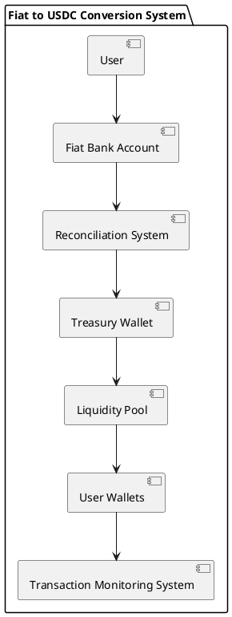
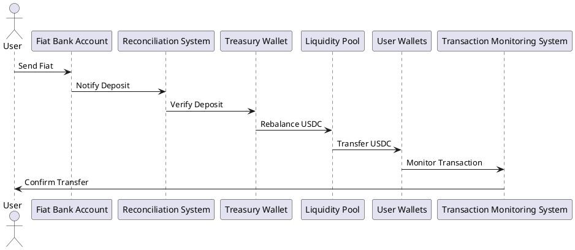
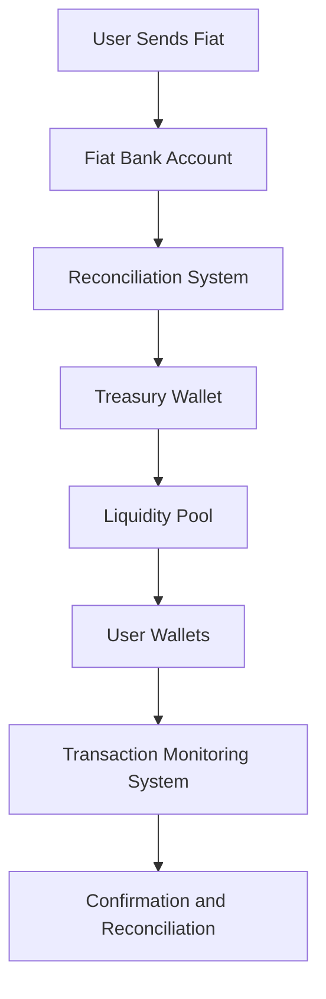
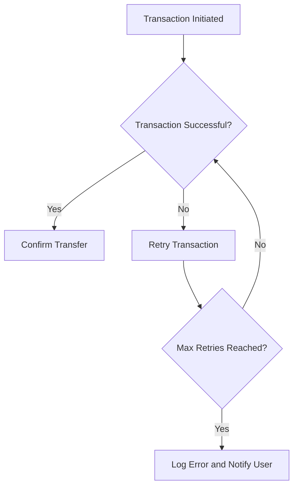

# System Design Diagrams and Documentation

## Technical Detailed Component Architecture

### Component Diagram


### Sequence Diagram


## Transaction Flow Patterns

### Sequence Diagram


## Reconciliation Algorithms

### Flowchart


## Error Handling Strategies

### Flowchart


## Technologies Used

### Development
- TypeScript
- Node.js
- Express.js
- PostgreSQL
- Redis
- Docker

### Blockchain
- Ethereum
- Solidity
- Web3.js

### Infrastructure
- AWS
- Kubernetes
- Terraform
- Jenkins

### Security
- HSM
- Multi-factor Authentication
- End-to-end Encryption

### Monitoring
- Prometheus
- Grafana
- ELK Stack

## Complete System Diagram

### Big Diagram
```plantuml
@startuml
!define RECTANGLE class
!define ACTOR actor
!define DATABASE database
!define CLOUD cloud

package "Fiat to USDC Conversion System" {
  ACTOR User
  RECTANGLE "User Service" as US
  RECTANGLE "Transaction Service" as TS
  RECTANGLE "Treasury Service" as TRS
  RECTANGLE "Monitoring Service" as MS
  DATABASE "User Database" as UDB
  DATABASE "Transaction Database" as TDB
  DATABASE "Treasury Database" as TRDB
  DATABASE "Monitoring Database" as MDB
  CLOUD "Blockchain Network" as BN
  CLOUD "Bank API" as BAPI

  User --> US : Register
  US --> UDB : Store User Data
  US --> BAPI : Verify Bank Details
  US --> User : Registration Complete

  User --> TS : Initiate Transaction
  TS --> TDB : Store Transaction Data
  TS --> BAPI : Detect Fiat Deposit
  TS --> TRS : Request USDC Distribution
  TRS --> TRDB : Store Treasury Data
  TRS --> BN : Transfer USDC
  TRS --> TS : Confirm USDC Transfer
  TS --> MS : Notify Monitoring Service
  MS --> MDB : Store Monitoring Data
  MS --> User : Confirm Transaction

  User --> MS : Monitor Transactions
  MS --> MDB : Retrieve Monitoring Data
  MS --> User : Display Monitoring Data
}
@enduml
```

## Complete System Flowchart

### Big Flowchart

```mermaid
flowchart TD
  subgraph UserInteraction
    A[User Registers] --> B[User Service]
    B --> C[User Database]
    B --> D[Bank API]
    D --> E[Bank Verification]
    B --> F[User Registration Complete]
  end

  subgraph TransactionProcessing
    G[User Initiates Transaction] --> H[Transaction Service]
    H --> I[Transaction Database]
    H --> J[Bank API]
    J --> K[Fiat Deposit Detection]
    H --> L[Treasury Service]
    L --> M[Treasury Database]
    L --> N[Blockchain Network]
    N --> O[USDC Transfer]
    L --> P[Transaction Confirmation]
    H --> Q[Monitoring Service]
    Q --> R[Monitoring Database]
    Q --> S[Transaction Monitoring]
  end

  subgraph TreasuryManagement
    T[Manage Treasury Wallet] --> U[Treasury Service]
    U --> V[Treasury Database]
    U --> W[Liquidity Pool]
    W --> X[Rebalance USDC]
    U --> Y[Risk Management]
  end

  subgraph MonitoringAndReporting
    Z[Monitor Transactions] --> AA[Monitoring Service]
    AA --> AB[Monitoring Database]
    AA --> AC[Alert Management]
    AA --> AD[Reporting]
    AA --> AE[Analytics]
  end

  subgraph Infrastructure
    AF[Deploy Services] --> AG[Kubernetes]
    AG --> AH[Microservices]
    AG --> AI[CI/CD Pipelines]
    AG --> AJ[Monitoring Setup]
  end

  subgraph Security
    AK[Implement Security Measures] --> AL[End-to-end Encryption]
    AL --> AM[HSM Integration]
    AL --> AN[Multi-factor Authentication]
    AL --> AO[Rate Limiting]
    AL --> AP[Fraud Detection]
  end

  subgraph Testing
    AQ[Run Tests] --> AR[Unit Tests]
    AR --> AS[Integration Tests]
    AR --> AT[Load Tests]
    AR --> AU[Security Tests]
    AR --> AV[Compliance Tests]
  end

  subgraph Documentation
    AW[Create Documentation] --> AX[API Documentation]
    AX --> AY[System Architecture Documentation]
    AX --> AZ[Deployment Guides]
    AX --> BA[User Manuals]
    AX --> BB[Admin Guides]
    AX --> BC[Security Documentation]
  end

  subgraph Compliance
    BD[Ensure Compliance] --> BE[GDPR Compliance]
    BE --> BF[Financial Regulations]
    BE --> BG[Data Protection]
    BE --> BH[Audit Requirements]
  end

  subgraph Deployment
    BI[Deploy System] --> BJ[Blue-green Deployment]
    BJ --> BK[Rollback Procedures]
    BJ --> BL[Backup Strategies]
    BJ --> BM[Disaster Recovery Plans]
  end
```

