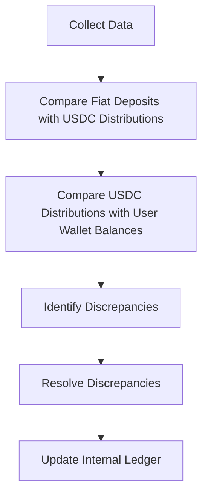

# Reconciliation Algorithms

This document provides a detailed overview of the reconciliation algorithms used in the production-ready system for converting fiat currency to USDC through a centralized treasury. The algorithms focus on ensuring accuracy, reliability, and scalability.

## Overview

Reconciliation is a critical process in the system to ensure that every fiat deposit and the corresponding USDC distribution are tracked accurately. The reconciliation algorithms compare bank account records, treasury balances, and user wallet transactions to identify and resolve discrepancies.

## Reconciliation Process

### 1. Data Collection

- Collect data from the bank account, including fiat deposits and transaction details.
- Collect data from the treasury wallet, including USDC balances and transaction details.
- Collect data from user wallets, including USDC balances and transaction details.

### 2. Data Comparison

- Compare the fiat deposits in the bank account with the corresponding USDC distributions in the treasury wallet.
- Compare the USDC distributions in the treasury wallet with the corresponding USDC balances in user wallets.

### 3. Discrepancy Identification

- Identify any discrepancies between the fiat deposits and USDC distributions.
- Identify any discrepancies between the USDC distributions and user wallet balances.

### 4. Discrepancy Resolution

- Resolve discrepancies by adjusting the treasury wallet or user wallet balances.
- Update the internal ledger to reflect the resolved discrepancies.

## Reconciliation Algorithm

The following algorithm outlines the steps for reconciling fiat deposits and USDC distributions:

1. Collect data from the bank account, treasury wallet, and user wallets.
2. For each fiat deposit in the bank account:
   a. Find the corresponding USDC distribution in the treasury wallet.
   b. If a matching USDC distribution is found, mark the deposit and distribution as reconciled.
   c. If no matching USDC distribution is found, mark the deposit as unreconciled.
3. For each USDC distribution in the treasury wallet:
   a. Find the corresponding USDC balance in the user wallets.
   b. If a matching USDC balance is found, mark the distribution and balance as reconciled.
   c. If no matching USDC balance is found, mark the distribution as unreconciled.
4. Identify any unreconciled deposits or distributions and resolve discrepancies.
5. Update the internal ledger to reflect the resolved discrepancies.

## Flowchart

The following flowchart illustrates the reconciliation process:

## Conclusion

This document provides a comprehensive overview of the reconciliation algorithms used in the production-ready system for converting fiat currency to USDC. The algorithms ensure accuracy, reliability, and scalability by tracking and resolving discrepancies between fiat deposits and USDC distributions.
