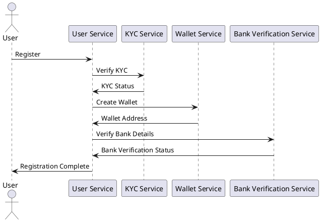
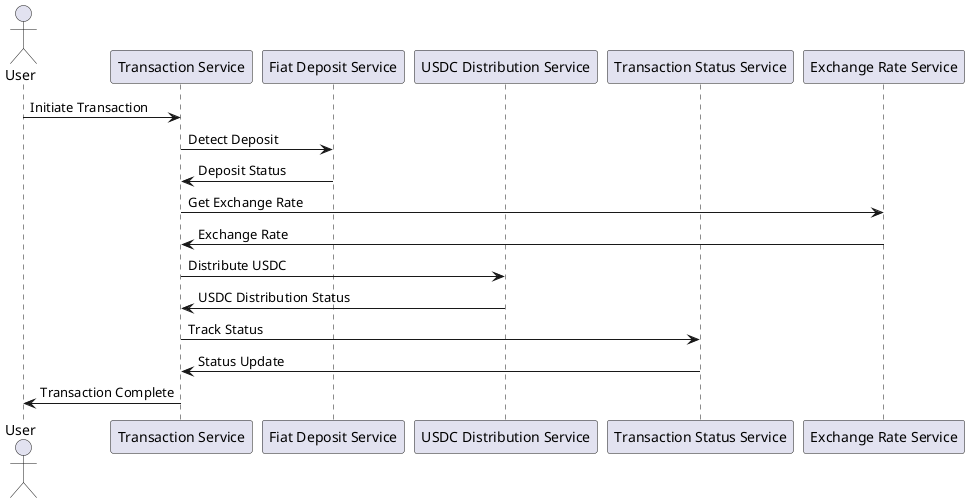

# System Architecture Documentation

## Overview

This document provides a detailed overview of the system architecture for the production-ready system for converting fiat currency to USDC through a centralized treasury. The architecture focuses on security, reliability, and scalability, and includes all necessary components from user interaction to blockchain integration.

## Component Diagrams

### User Service
- Complete authentication system
- KYC integration
- Wallet management
- User preferences

### Transaction Service
- Payment processing
- Exchange rate management
- Fee calculation
- Transaction status tracking

### Treasury Service
- Wallet management
- Liquidity pool operations
- Rebalancing logic
- Risk management

### Monitoring Service
- Transaction monitoring
- Alert management
- Reporting
- Analytics

### Smart Contracts
- Treasury contract
- User wallet contract
- Transaction verification
- Access control

### Frontend Components
- User dashboard
- Transaction management
- Admin panel
- Reporting interface

## Sequence Diagrams

### User Registration Flow

### Transaction Processing Flow

## Network Architecture

The system is designed using a microservices-based architecture, with each service running in its own container. The services communicate with each other using RESTful APIs and are deployed on a Kubernetes cluster for high availability and scalability.

### Components
- User Service
- Transaction Service
- Treasury Service
- Monitoring Service
- Smart Contracts
- Frontend Components

### Communication
- RESTful APIs
- Event-driven architecture using message queues

## Database Schema

The system uses a relational database to store user information, transaction details, and other relevant data. The database schema includes the following tables:

- Users
  - id (UUID)
  - name (VARCHAR)
  - email (VARCHAR)
  - kyc_status (VARCHAR)
  - wallet_address (VARCHAR)
  - bank_verified (BOOLEAN)

- Transactions
  - id (UUID)
  - user_id (UUID)
  - amount (DECIMAL)
  - currency (VARCHAR)
  - status (VARCHAR)
  - exchange_rate (DECIMAL)
  - usdc_amount (DECIMAL)

- Treasury Operations
  - id (UUID)
  - type (VARCHAR)
  - status (VARCHAR)
  - details (JSON)

- Monitoring Events
  - id (UUID)
  - type (VARCHAR)
  - status (VARCHAR)
  - details (JSON)

## API Documentation

The API documentation is provided in OpenAPI format and includes detailed information about the endpoints, request and response formats, and authentication mechanisms.

## Conclusion

This document provides a comprehensive overview of the system architecture for the production-ready system for converting fiat currency to USDC. The architecture is designed to be secure, reliable, and scalable, and includes all necessary components from user interaction to blockchain integration.
