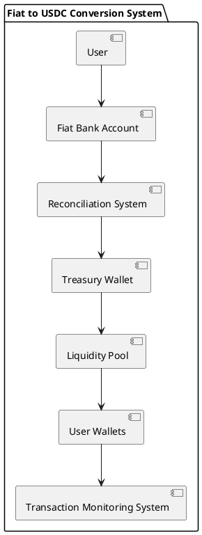
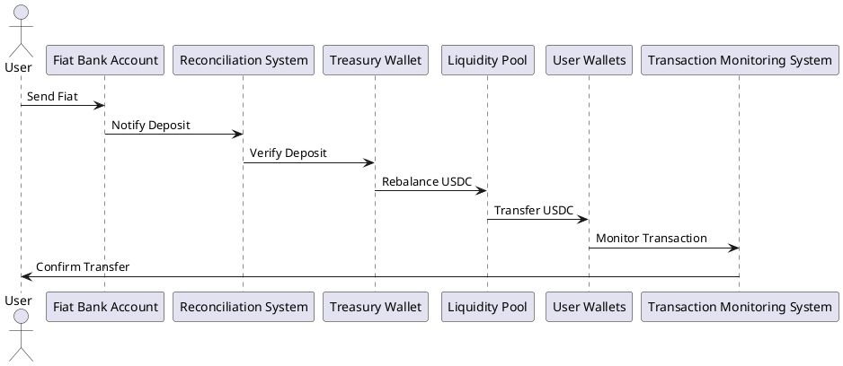

# Technical Detailed Component Architecture

## Overview

This document provides a detailed overview of the technical component architecture for the production-ready system for converting fiat currency to USDC through a centralized treasury. The architecture focuses on security, reliability, and scalability, and includes all necessary components from user interaction to blockchain integration.

## Key Components and Architecture

### 1. Treasury Wallet
A secure wallet holding the USDC that will be sent to users after receiving fiat payments. It should be multi-sig or use some form of heightened security (especially for large transfers).

### 2. Fiat Bank Account (Onramp)
A bank account where users send their fiat. The system will need a reliable way to detect deposits in real-time (via webhook, API integration with the bank, or batch reconciliation).

### 3. Liquidity Pool (Rebalancing)
The liquidity pool ensures that you have enough USDC to fulfill user requests without draining your treasury wallet. The liquidity pool can be internally managed or connected to external liquidity sources.

### 4. User Wallets
The destination for the fiat-onramp user’s USDC after rebalancing.

### 5. Reconciliation System
Tracks all deposits and transactions to ensure that there’s no discrepancy between the fiat received and USDC sent. The system needs a mechanism for comparing bank account records, treasury balances, and user wallet transactions.

### 6. Transaction Monitoring System
Monitors the state of the blockchain to ensure the USDC transfer is successful. This system should also handle retries for failed transactions.

## Component Diagrams

### Component Diagram

### Sequence Diagram

## Conclusion

This document provides a comprehensive overview of the technical component architecture for the production-ready system for converting fiat currency to USDC. The architecture is designed to be secure, reliable, and scalable, and includes all necessary components from user interaction to blockchain integration.
