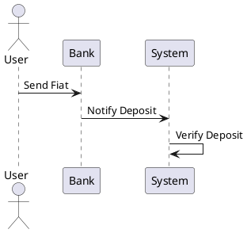
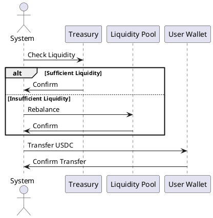
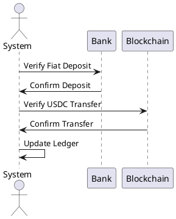

# Transaction Flow Patterns

This document provides a detailed overview of the transaction flow patterns for the production-ready system for converting fiat currency to USDC through a centralized treasury. The flow patterns focus on security, reliability, and scalability.

## Transaction Flow

### 1. User Sends Fiat to Bank

- The user initiates a fiat transfer to your bank account.
- The system tracks this transaction in real-time or via batch reconciliation.

### 2. Fiat Deposit Notification

- The system (via API or webhook) receives notification when fiat is deposited into the bank account.
- The amount deposited is verified against user information (e.g., deposit reference).

### 3. Fiat to USDC Conversion

- Upon verification, the system ensures sufficient liquidity exists in the treasury or liquidity pool.
- The system rebalances the fiat deposit into USDC from the liquidity pool or treasury.

### 4. USDC Transfer to User’s Wallet

- The equivalent amount of USDC is sent from the treasury wallet (or liquidity pool) to the user’s wallet on-chain.
- The transaction is logged for transparency and tracking.

### 5. Confirmation and Reconciliation

- Once the transfer is completed, both the bank and blockchain transactions are reconciled.
- The system verifies that the amount of USDC matches the fiat deposited and updates the internal ledger.

## Sequence Diagrams

### User Sends Fiat to Bank

### Fiat to USDC Conversion

### Confirmation and Reconciliation

## Conclusion

This document provides a comprehensive overview of the transaction flow patterns for the production-ready system for converting fiat currency to USDC. The flow patterns ensure security, reliability, and scalability, and include detailed sequence diagrams for each step of the process.
